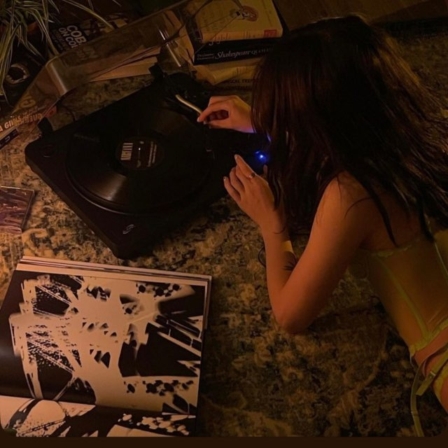

# aftertaste

> A private Telegram channel that writes itself — in my voice.
> Every night, Claude picks a track from my taste database, writes a
> scene-driven post in my authorial style, and the bot publishes it.

**Channel:** [@aftertaste_archive](https://t.me/aftertaste_archive)



---

## TL;DR

I'm a product designer. I wanted to understand how to **work with AI as a
design material** — not just "ask ChatGPT something". So I built a small
personal project where the output quality is immediately visible: a daily
music channel where every post must sound like me, not like a generic AI.

The system runs on ~270 lines of Python and costs ~$1/month. But the code
isn't where the value lives. The value lives in two artifacts I designed
carefully: a **taste database** (what I love and how I listen) and a
**manifesto** (how I feel music — through scenes from life, not analysis).
The code is just plumbing.

---

## Why music

Music has been with me since I was a kid. I started with classical — accordion
and piano. Later I sang. Then I fell into electronic music and started
DJing. Eventually I learned to produce in Ableton. So music isn't a hobby
for me; it's something I've been thinking through my whole life, from many
sides — as a performer, as a DJ, as someone who builds a track from
scratch and understands what every layer is doing.

But the way I actually *listen* has nothing to do with all that knowledge.
I'm a very sensory person. Sometimes I can't explain why something hits me
— I just feel it. The same thing happens to me with scenes in films,
paintings, the way light falls on a wall, the way a stranger walks across
the street. I notice everything, and I understand that everyone perceives
the world slightly differently.

I love niche perfume for the same reason. A specific smell can throw me
back ten years in a second — into a kitchen, an apartment, a season of my
life. Music does the same thing. It doesn't describe — it *returns* you.

So I didn't want a channel that explains music. I wanted a channel that
**returns the reader to a scene**, the way perfume does. The track is just
the trigger.

## The starting point

This wasn't a problem I set out to solve. It was a question I wanted to
live with.

The question was: *what does it look like when a machine writes about
music the way I feel it?* Not the way magazines write, not the way
playlists describe themselves — the way I describe a track to myself
when no one's watching. As a scene, a smell, a piece of weather.

I didn't know if it would work. I built the smallest possible version
to find out. A database of tracks I love, a manifesto describing how I
write, a script that connects them, a bot that publishes the result.
If it sounded like me, the experiment would have answered something.
If it didn't, I'd have learned something else.

It didn't sound exactly like me — but it came close. Close enough to feel
like the idea actually worked. And now I want to keep developing it: make
the manifesto more sensitive, grow the database (the first version was
put together very quickly, almost in one breath), and bring Claude closer
to what I actually feel.

Honestly, I never thought I could make something like this.

---

## What I built

```
Google Sheets (taste DB)  →  Python orchestrator  →  Claude API  →  Telegram bot  →  channel
       ↑                              ↓                                       ↓
   I edit on phone               manifesto.md                          published.json
                              (the channel's voice)                  (memory of past posts)
                                       ↑
                              GitHub Actions (cron 22:30)
```

A single Python script reads my database, asks Claude to pick one unused
track and write a post following the manifesto, validates the response, and
publishes through a Telegram bot. The whole thing runs on a free GitHub
Actions cron — no server, no maintenance.

---

## The process — 6 steps

### 1. Taste database (Google Sheets)

The "memory" of the system. Six sheets: tracks (with YouTube links), artists,
genres, moods, stop-list, published. I keep it in Google Sheets so I can
edit from my phone, and the script reads it as a published CSV — no OAuth,
no API keys, one HTTP request.

> **Design decision:** the database is intentionally **personal and messy**.
> Columns like "what to say about this track" contain things like *"this
> bassline sounds like someone walking through an empty parking lot at 4 AM"*.
> The more specific and personal these notes, the better the posts come out.
> Generic notes produce generic posts. The database is half my work.

### 2. Channel manifesto (`manifesto.md`)

A plain text file describing the channel's voice. Who's writing, what tone,
what structure each post has, what's forbidden, when to rotate scene types.

> **This is the most important file in the project.** It's effectively a
> design system for text — tokens, rules, anti-patterns. When I want to
> change the channel's style, I edit this one file and the next night's post
> reflects it. No retraining, no fine-tuning. Just words.

### 3. Orchestrator script (`main.py`)

~270 lines of Python that glue everything together. Reads the database,
loads the manifesto, gathers the last 5 posts (for the scene-rotation rule),
builds the prompt, calls Claude, parses the JSON response, validates that
the YouTube URL actually exists in the database (guard against
hallucinations), sends to Telegram, logs the result.

> **Design decision:** ask Claude to return strict JSON, not freeform text.
> A structured response with named fields means the script reliably extracts
> what it needs (URL, artist, post body) instead of guessing where things
> are in a wall of text.

### 4. Claude API as the engine

The script sends two things to Claude: the manifesto as a system prompt,
and a user prompt with available tracks + recent history. Claude returns a
single JSON object: which track it picked and the finished post.

> **Cost:** ~$0.02–0.04 per post on Claude Opus. About $1/month total.

### 5. Telegram bot + channel

Standard `sendMessage` API call with `parse_mode=Markdown` and link previews
enabled, so YouTube auto-attaches the album art and inline player. The bot
is an admin in the channel; that's the only permission setup needed.

### 6. GitHub Actions for scheduling

A YAML file with two cron entries — one for Warsaw winter time, one for
summer time — runs the script every night at 22:30 local. After publishing,
the workflow commits the updated `published.json` and `recent_posts.json`
back to the repo, so the system remembers what it's already done across
runs. Free for private repos, no server to maintain.

---

## Example: before vs after

To show what "voice" means here, compare a generic AI-written post about a
track to what the system actually generates every night.

### Generic AI post (the kind I didn't want)

> 🎵 Tropic of Cancer — "Plant Lilies At My Head"
>
> A haunting darkwave classic from the *Restless Idylls* album. The dreamy
> atmosphere and ethereal vocals make this perfect for late-night listening.
> Highly recommended for fans of the genre! 🔥
>
> #darkwave #postpunk #moody

### Real post from the channel

> *квартира на втором этаже, окна выходят во двор, где никто не живёт уже
> месяц. на подоконнике стоит стакан с водой, в нём отражается уличный
> фонарь и чуть-чуть дрожит — где-то под полом запустился старый
> холодильник. в комнате пахнет остывшим воском и стиральным порошком с
> балкона соседей.*
>
> *ничего не происходит. просто поздно, и хорошо, что поздно.*
>
> https://www.youtube.com/watch?v=9uMyhMHYLZ4
>
> *Tropic of Cancer — Plant Lilies At My Head · Restless Idylls, 2013*

### Another real post

> *тёмный зал, давно за полночь. на танцполе человек двадцать, и все стоят
> достаточно далеко друг от друга, чтобы не пересекаться телами, но
> достаточно близко, чтобы чувствовать чужое дыхание в одном воздухе.
> кто-то впереди медленно поднимает руку к потолку и держит её там минуту,
> две, пять — никто не считает. время в этом зале выключили вместе со
> светом, и осталась только пульсация в грудной клетке и солёный запах
> кожи. на выходе будет четыре утра, но об этом ещё никто не знает.*
>
> https://www.youtube.com/watch?v=zWeYcNfYn3U
>
> *Prince Of Denmark — GS · 8, 2016*

Same kind of track, completely different artifact from a generic AI version.
One is a recommendation; the other is a scene the reader walks into. The
difference is not in the model — it's in the manifesto and the taste
database.

> _Add 2–3 real screenshots from the channel here as `docs/post-1.png`,
> `docs/post-2.png`, `docs/post-3.png`._

---

## What I learned along the way

### 1. The manifesto matters more than the code

The script took an afternoon. The manifesto took many tries and a lot of
reading the output back to myself, asking *does this sound like me?*
The text that describes the voice ended up being the actual product —
the code just runs it.

### 2. Taste is the part the AI doesn't have

The model can write competently about almost anything. What it can't do is
decide what's *good* — what to post, what sounds like me and what doesn't.
That judgement has to come from me. A lot of the work on this project was
just reading the output and going "no, not that" until it got closer.

### 3. What you put in is what you get out

If my notes about a track were generic ("nice melody"), the post was
generic. If my notes were specific ("this bass sounds like footsteps
in an empty parking lot at 4 AM"), the post became specific too. The
database is half the work. Honestly, more than half.

---

## What's next

A few directions I'm considering:

- **Self-review before publishing.** Claude reads its own draft against a
  checklist from the manifesto and rewrites if it fails — the equivalent of
  a design critique baked into the pipeline.
- **Track discovery agent.** A weekly job that finds new releases from
  artists in my database (or adjacent ones) and proposes additions for me
  to approve.
- **Engagement feedback loop.** Use which posts resonate (reactions, saves)
  to inform future track selection — closing the loop with data.
- **Bring the method to work.** The "database + manifesto + thin script"
  pattern works far beyond music posts — UX copy in a consistent
  tone-of-voice, research summary drafts, content for design mockups.

---

## Stack

- **Python 3.12** — orchestrator
- **Claude API** (Opus model) — generation
- **Google Sheets** (published CSV) — database
- **Telegram Bot API** — distribution
- **GitHub Actions** — scheduling and state persistence

Total: ~270 lines of code, ~$1/month, zero servers.

---

## A note on this repo

This is a personal project published as a case study, not as a product or
a template. The code works for my specific channel; the actual taste
database and channel content are not included. If you want to build
something similar, the interesting parts to study are the structure of
`manifesto.md` and the prompt-building logic in `main.py` — that's where
the design decisions live.

The channel is open — feel free to drop by.

---

*Built by a product designer who wanted to learn what working with AI
actually feels like. Turns out it feels a lot like design.*
